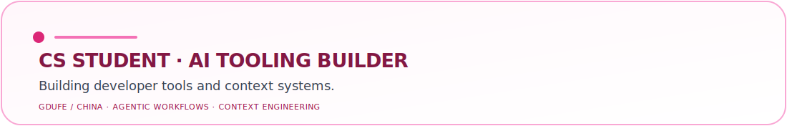

<picture>
  <source media="(prefers-color-scheme: dark)" srcset="./assets/profile-hero-dark.svg" />
  <source media="(prefers-color-scheme: light)" srcset="./assets/profile-hero-light.svg" />
  
</picture>

  
  
  
  
  
  
  

<picture>
  <source media="(prefers-color-scheme: dark)" srcset="./assets/profile-intro-dark.svg" />
  <source media="(prefers-color-scheme: light)" srcset="./assets/profile-intro-light.svg" />
  
</picture>

  <a href="https://chasen-intro.vercel.app/">Personal Site</a>
  ·
  <a href="https://chasenclog.vercel.app/">Blog</a>
  ·
  <a href="mailto:2558891266@qq.com">Email</a>

### `// SELECTED_WORK`

<table>
  <tr>
    <td colspan="3" valign="top">
      <code>FLAGSHIP / 01</code>
      <h3><a href="https://github.com/Chasen-Liao/pi-agent-desktop">pi-agent-desktop</a></h3>
      
<strong>DESKTOP AI</strong>

      
Electron desktop client for the Pi coding agent.

      
<code>TypeScript</code> <code>Electron</code> <code>AI tooling</code>

      
    </td>
  </tr>
  <tr>
    <td width="33%" valign="top">
      <code>AI ENGINEERING / 02</code>
      <h3><a href="https://github.com/Chasen-Liao/SuperMew">SuperMew</a></h3>
      
Agentic RAG focused on context engineering and memory architecture.

      
<code>Python</code> <code>RAG</code>

      
    </td>
    <td width="33%" valign="top">
      <code>AI-NATIVE TOOLS / 03</code>
      <h3><a href="https://github.com/Chasen-Liao/resume-skills">resume-skills</a></h3>
      
Claude Code skills for resume generation and job-description matching.

      
<code>Claude Code</code> <code>HTML</code>

      
    </td>
    <td width="33%" valign="top">
      <code>KNOWLEDGE SYSTEM / 04</code>
      <h3><a href="https://github.com/Chasen-Liao/Everything-claude-code-Doc">Everything-claude-code-Doc</a></h3>
      
A practical, continuously updated guide to using Everything Claude Code.

      
<code>Python</code> <code>Documentation</code> <code>Claude Code</code>

      
    </td>
  </tr>
</table>

 

### `// GITHUB_SNAPSHOT`

  <a href="https://github.com/Chasen-Liao">
    <picture>
      <source media="(prefers-color-scheme: dark)" srcset="./assets/github-stats-dark.svg" />
      <source media="(prefers-color-scheme: light)" srcset="./assets/github-stats-light.svg" />
      
    </picture>
  </a>

 

### `// CONTRIBUTION_SNAKE`

<table>
  <tr>
    <td>
      
<strong>Shipping consistently, one contribution at a time.</strong>

      <picture>
        <source media="(prefers-color-scheme: dark)" srcset="https://raw.githubusercontent.com/Chasen-Liao/Chasen-Liao/output/github-contribution-grid-snake-dark.svg" />
        <source media="(prefers-color-scheme: light)" srcset="https://raw.githubusercontent.com/Chasen-Liao/Chasen-Liao/output/github-contribution-grid-snake.svg" />
        
      </picture>
    </td>
  </tr>
</table>

   
  <a href="https://chasen-intro.vercel.app/">More about me →</a>

